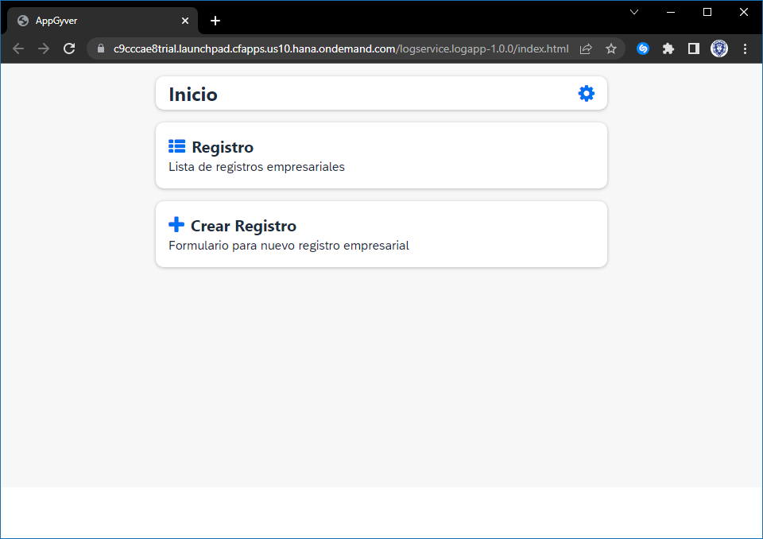

# Deploy SAP AppGyver App to Fiori Launchpad service

## Description

This is an example of a SAP AppGyver HTML5 app that is accessed by a managed application router and is integrated into the SAP Launchpad service. During the deployment (`cf deploy`), the HTML5 app is pushed to the HTML5 Application Repository and uses the Authentication & Authorization service (XSUAA service) and the destination service.

## Download and Deployment
1. Subscribe to the [SAP Launchpad service](https://developers.sap.com/tutorials/cp-portal-cloud-foundry-getting-started.html).
2. Download the source code:
    ```
    git clone https://github.com/GerardoDiaz22/sample-appgyver.git
    cd sample-appgyver
    ```
3. Build the project:
    ```
    npm install
    npm run build
    ```
4. Log in to Cloud Foundry:
    ```
    cf login
    ```
5. Deploy the project:
    ```
    cf deploy mta_archives/log-app_1.0.0.mtar
    ```
6. See the URL of the web app:
    ```
    cf html5-list -di log-app-destination-service -u --runtime launchpad
    ```

## Check the Result

### List the Deployed HTML5 Apps
```
$ cf html5-list -di log-app-destination-service -u --runtime launchpad                                 
Getting list of HTML5 applications in org 9f10ed8atrial / space dev as firstname.lastname@domain.com...
OK

name       version   app-host-id                            service name    destination name                        last changed                    url   
logapp     1.0.0     bcd2d34a-1625-47ab-bf42-4f054970b911   log.service     my_service_hello_world_html_repo_host   Tue, 16 Feb 2021 10:51:10 GMT   {url}
```


### List the Deployed MTA

```
$ cf mta hello-world
Showing health and status for multi-target app hello-world in org 9f10ed8atrial / space dev as firstname.lastname@domain.com...
OK
Version: 1.0.0

Apps:
name   requested state   instances   memory   disk   urls   

Services:
name                                 service           plan          bound apps   last operation   
hello-world-destination-service      destination       lite                       create succeeded   
hello-world-html5-app-host-service   html5-apps-repo   app-host                   create succeeded   
hello-world-xsuaa-service            xsuaa             application                create succeeded  

```

### Check the HTML5 App

Access the URL described in [Download and Deployment](#download-and-deployment) to view the web app. You are redirected to a sign-on page before you can see the web app.


